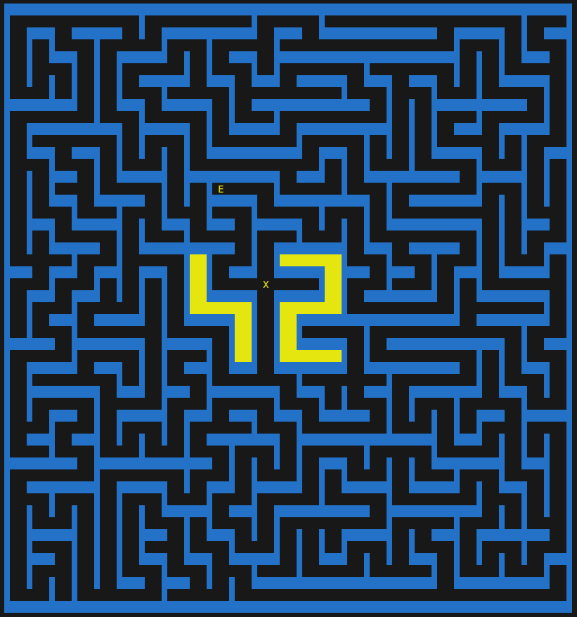
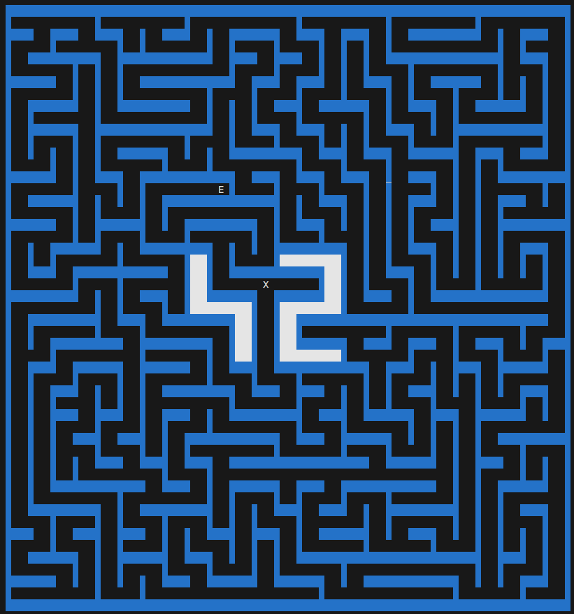
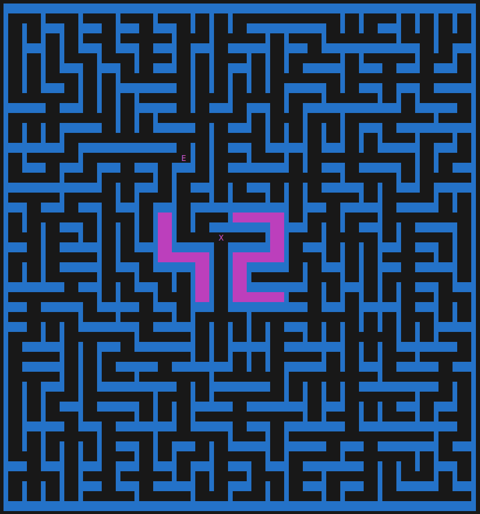
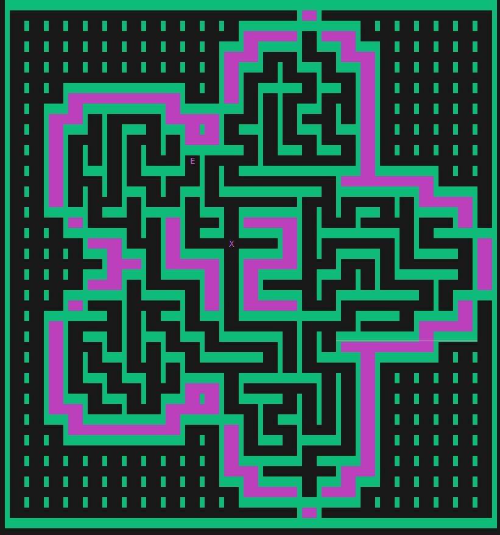
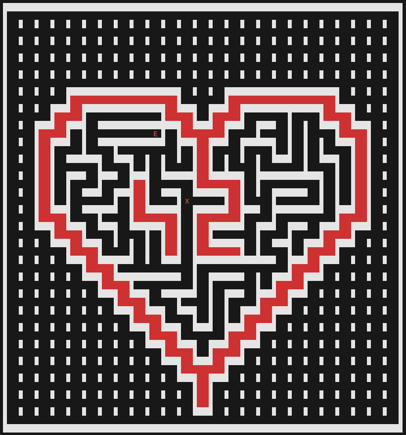
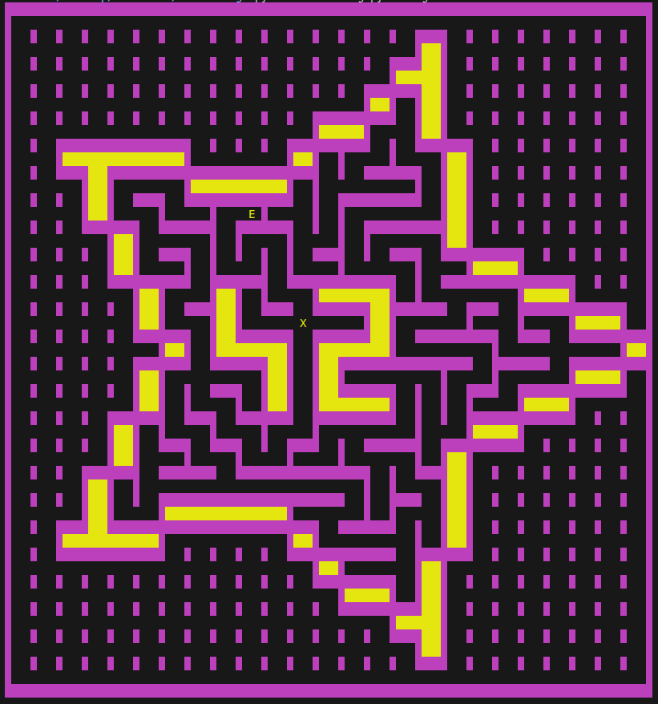
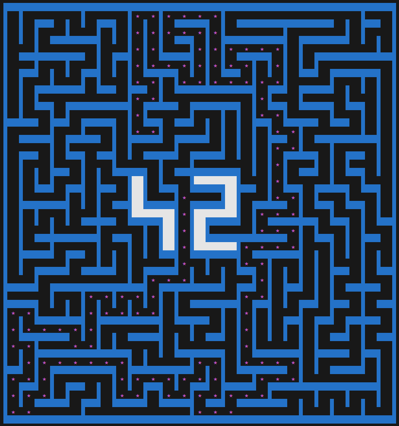

*This project was created as part of the 42 curriculum by aabi-mou and mfakih.*

# Description

`A-maze-ing` is a configurable maze generator and solver with two interactive display modes:

- Python ASCII display (terminal menu)
- C MiniLibX display (graphical window with controls)

The workflow is straightforward: read configuration, generate a maze, solve it, save outputs, then render the result.

Core features:

- Multiple generation algorithms (`dfs`, `bfs`, `prim`, `huntkill`)
- Multiple solver algorithms (`dfs`, `bfs`, `a*`, `ucs`, `greedy`)
- Shape support (`square`, `heart`, `flower`, `star`)
- Perfect or non-perfect maze generation
- Color customization for walls, flags, and solution path
- Runtime interactive controls in both display modes

# Flow

<p align="center">
  
</p>

# Example output

## Ascii display example outputs:

### Generation algorithms:

- DFS algorithm maze




- Hunt-and-Kill algorithm maze




- Prim algorithm maze



### Different shapes:

- Flower shape




- Heart shape




- Star shape



### Showing the solution path:



# Instructions

## 1. Prerequisites

- Python 3.10+ (tested locally with Python 3.12)
- GCC and `make`
- X11 development libraries (for MiniLibX mode on Linux)

## 2. Project setup

```bash
git clone git@vogsphere.42beirut.com:vogsphere/intra-uuid-a96ca7bd-39f8-463b-b5ac-20628b80fe8c-7216753-aabi-mou
cd A-maze-ing
```

Optional virtual environment:

```bash
python3 -m venv .venv
source .venv/bin/activate
```

Install MiniLibX:

```bash
git clone https://github.com/42paris/minilibx-linux.git
```

## 3. Install dependencies and run project

```bash
make install
make lint
make run
make clean
```

To run in debug mode:

```bash
make debug
```

Config file location:

- `configuration/config.txt`

# Config file / additional features

Mandatory keys:

- `WIDTH`
- `HEIGHT`
- `ENTRY`
- `EXIT`

Optional keys:

- `OUTPUT_FILE` (must end with `.txt`)
- `PERFECT` (`true` / `false`)
- `SHAPE` (`square`, `heart`, `flower`, `star`)
- `GENERATION_ALGORITHM` (`dfs`, `bfs`, `prim`, `huntkill`)
- `SOLVER_ALGORITHM` (`dfs`, `bfs`, `a*`, `ucs`)
- `DISPLAY_MODE` (`ascii`, `minilibx`)
- `WALL_COLOR`
- `FLAG_COLOR`
- `PATH_COLOR`

Example (`configuration/config.txt`):

```ini
WIDTH=35
HEIGHT=35
ENTRY=6,10
EXIT=29,16
OUTPUT_FILE=maze.txt
PERFECT=true
SHAPE=heart
GENERATION_ALGORITHM=bfs
SOLVER_ALGORITHM=dfs
DISPLAY_MODE=minilibx
WALL_COLOR=light_blue
FLAG_COLOR=light_magenta
PATH_COLOR=grey
```

Notes:

- `ENTRY` and `EXIT` format is `x,y`
- Wall and flag colors are validated to prevent identical values

## 5. Display modes

Choose the display mode in the configuration file:

- `DISPLAY_MODE=ascii`
  - Terminal output with an interactive menu to:
    - regenerate the maze
    - toggle solution path visibility
    - change wall/flag/path colors
    - change shape
    - change generation/solver algorithm

- `DISPLAY_MODE=minilibx`
  - Graphical window with animation and a button panel
  - Buttons update config values and regenerate automatically

# Maze generation algorithms
---

## 1. DFS Generator (Depth-First Search / backtracking style)

Type: Stack-based traversal.

How it works:

- starts from the entry cell
- carves into unvisited neighbors using randomized order
- continues until all reachable cells are processed

Texture:

- long corridors
- many dead ends

## 2. BFS Generator (Breadth-First style carving)

Type: Queue-based traversal.

How it works:

- starts from the entry cell
- expands layer-by-layer through randomized neighbor ordering
- carves edges when visiting new cells

Texture:

- more even spread
- broader branching pattern than DFS

## 3. Randomized Prim Generator

Type: Frontier-based randomized Prim variant.

How it works:

- maintains a frontier list
- selects random frontier edges
- carves only when the target cell is unvisited

Texture:

- organic branching
- balanced global spread

## 4. Hunt-and-Kill Generator

Type: Hybrid walk-and-hunt strategy.

How it works:

- performs randomized walk carving
- when stuck, hunts for the next valid frontier candidate
- repeats until completion

Texture:

- mixed corridor lengths
- varied branching density

## Maze solving algorithms

## 1. DFS Solver (Depth-First Search)

Type: Stack-based deep exploration.

How it works:

- starts from the entry cell
- explores one branch as far as possible before backtracking
- stops when the exit is reached

Behavior in this project:

- quickly finds a valid path in many cases
- does not guarantee the shortest path
- can produce longer, winding solutions depending on branch order

## 2. BFS Solver (Breadth-First Search)

Type: Queue-based level exploration.

How it works:

- starts from the entry cell
- visits neighbors layer by layer
- reconstructs the path once the exit is discovered

Behavior in this project:

- guarantees the shortest path by number of steps in the maze grid
- usually explores more cells than DFS before reaching the exit
- provides predictable, reliable shortest-path results

## 3. A* Solver (A-Star Search)

Type: Cost + heuristic guided search.

How it works:

- prioritizes cells using a score: current path cost + estimated distance to exit
- always expands the most promising frontier cell first
- reconstructs the final route when the exit is reached

Behavior in this project:

- typically reaches the goal faster than BFS on larger mazes
- still returns an optimal shortest path when using an admissible heuristic
- reduces unnecessary exploration compared to uninformed search

## 4. UCS Solver (Uniform-Cost Search)

Type: Priority-queue search by accumulated path cost.

How it works:

- starts from the entry cell with cost `0`
- always expands the lowest-cost frontier state
- reconstructs the path when the exit is popped from the priority queue

Behavior in this project:

- returns the minimum-cost path according to the solver cost model
- behaves similarly to BFS when all moves have equal cost
- forms a clean baseline for comparing weighted and heuristic search

# Reusable parts

Main reusable components in this repo:

- `project/parsing/parsing.py`
  - Config parsing and validation
- `mazegen/generators/`
  - Generator abstraction and algorithm implementations
- `mazegen/solvers/`
  - Solver abstraction and algorithm implementations
- `project/maze_displayer/ascii_display/ascii_display.py`
  - Terminal renderer and runtime menu
- `project/maze_displayer/minilibx_display/`
  - C renderer and runtime button controls

Output contracts:

- Maze output file in `output/*.txt`
- Generation path file in `configuration/gen_path.txt`

# Roles

Team collaboration covered:

- architecture and planning
- generator and solver implementation
- parsing and validation
- ASCII interaction design
- MiniLibX graphical interface and animation
- testing, debugging, and integration

# Resources

General references used during design and learning:

- Makefile:
  - https://earthly.dev/blog/python-makefile/
- MiniLibX:
  - https://medium.com/@jalal92/understanding-the-minilibx-a-practical-dive-into-x-window-programming-api-in-c-cb8a6f72bec3
  - https://www.youtube.com/watch?v=bYS93r6U0zg&t=286s
